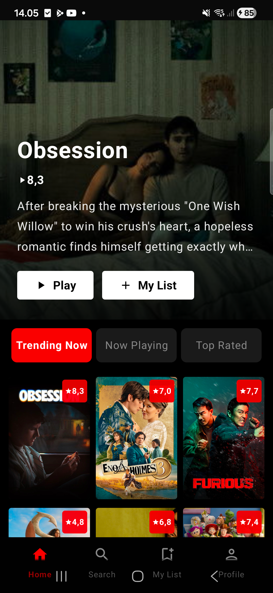
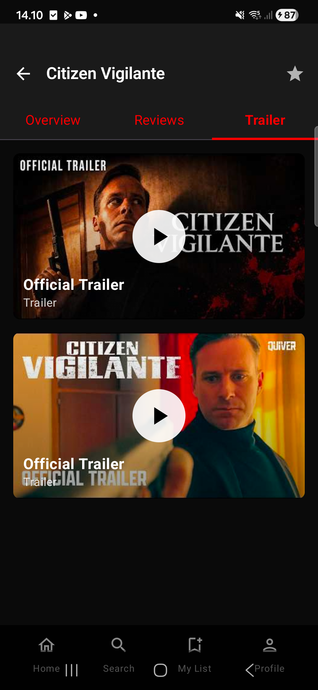

# MyMovieFlix

A Netflix-style movie browsing Android application built with Kotlin and Jetpack Compose. Browse trending movies, search by title or genre, watch trailers, and save your favorite movies to a personal list.

## Screenshots

| Home Screen | Trailer Player |
|:---:|:---:|
|  |  |
| **Home** - Browse trending, now playing, and top rated movies with hero banner and tabbed carousel | **Trailer** - Watch YouTube trailers directly in-app using youtube-player library |

## Features

- **Splash Screen** - Animated app launch screen with Android 12+ Splash Screen API
- **Home** - Hero banner with featured movie, tabbed carousels (Trending / Now Playing / Top Rated)
- **Search** - Search movies by title or browse by genre with clickable genre chips
- **Movie Detail** - Full movie info with poster, overview, ratings, genres, budget, production companies, and reviews
- **YouTube Trailer** - Embedded YouTube player that auto-plays trailers in-app
- **My List** - Save and manage favorite movies with love/favorite button synced from detail screen
- **Profile** - Netflix-style profile page with menu items and sign out
- **Bottom Navigation** - Persistent bottom nav with Home, Search, My List, and Profile
- **Offline Support** - Room database caching for genres, movies, and user list

## Tech Stack

| Category | Technology |
|---|---|
| Language | Kotlin 2.0.21 |
| UI | Jetpack Compose + Material 3 |
| Architecture | Multi-module (app, core, feature) |
| DI | Hilt 2.51.1 |
| Networking | Retrofit 2.9.0 + Moshi + OkHttp |
| Database | Room 2.6.1 |
| Image Loading | Coil 2.6.0 |
| Navigation | Navigation Compose 2.8.4 |
| Paging | Paging 3.3.2 |
| YouTube | youtube-player 12.1.2 |
| API | TMDB (The Movie Database) |

## Architecture

The project follows a **multi-module Clean Architecture** pattern:

```
MyMovieFlix/
├── app/                    # Main application module
│   ├── data/               # MovieRepositoryImpl
│   ├── di/                 # Hilt DI modules
│   ├── navigation/         # NavGraph, Screen routes
│   └── ui/                 # Screens, ViewModels, Theme
├── core/
│   ├── common/             # Constants, Resource, ConnectivityObserver
│   ├── database/           # Room DB, DAOs, Entities
│   ├── domain/             # Models, Repository interface
│   ├── network/            # TMDB API, DTOs, Mappers
│   └── ui/                 # Shared components (MovieCard, HeroBanner, BottomNav)
├── feature/
│   ├── detail/             # Movie detail screen + trailer
│   ├── genres/             # Genre listing
│   └── movies/             # Movie list by genre
```

## Setup

1. Clone the repository:
   ```bash
   git clone https://github.com/alphadevthasa/mymovieflix.git
   ```

2. Get a TMDB API key from [themoviedb.org](https://www.themoviedb.org/settings/api)

3. Add your token to `local.properties`:
   ```properties
   TMDB_ACCESS_TOKEN=your_tmdb_access_token_here
   ```

4. Build and run the project in Android Studio.

## Requirements

- Android Studio Ladybug (2024.2+) or later
- JDK 17
- Android SDK 35
- Min SDK 24 (Android 7.0)

## License

This project is for educational purposes. Movie data provided by [TMDB API](https://www.themoviedb.org/documentation/api).
